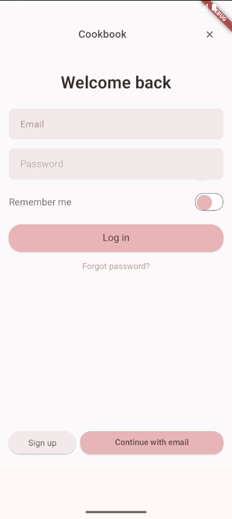
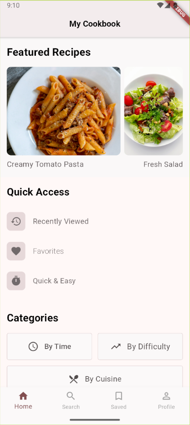
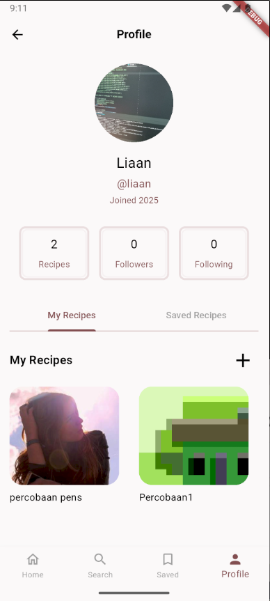

# Cook Book App 🍳

Aplikasi resep masakan yang dibuat menggunakan Flutter dengan backend Supabase. Aplikasi ini memungkinkan pengguna untuk mencari, menyimpan, dan mengelola resep masakan favorit mereka.

## ✨ Fitur Utama

- 🔍 **Pencarian Resep** - Cari resep dari TheMealDB API
- 📖 **Detail Resep Lengkap** - Lihat bahan-bahan dan langkah memasak
- ❤️ **Simpan Favorit** - Simpan resep favorit ke koleksi pribadi
- 👤 **Manajemen Profil** - Kelola profil pengguna dengan foto
- ➕ **Buat Resep** - Tambah resep pribadi dengan gambar
- ✏️ **Edit Resep** - Ubah resep yang sudah dibuat
- 🎲 **Resep Random** - Dapatkan inspirasi resep acak
- 📱 **Responsive Design** - UI yang menarik dan user-friendly

## 🚀 Teknologi yang Digunakan

- **Frontend**: Flutter (Dart)
- **Backend**: Supabase
- **Database**: PostgreSQL (via Supabase)
- **Storage**: Supabase Storage untuk gambar
- **Authentication**: Supabase Auth
- **API**: TheMealDB API untuk resep eksternal

## 📦 Dependencies

```yaml
dependencies:
  flutter:
    sdk: flutter
  supabase_flutter: ^latest
  http: ^latest
  image_picker: ^latest
  cached_network_image: ^latest
  # dan lainnya...
```

## 🛠️ Setup & Installation

### Prerequisites
- Flutter SDK (>= 3.0.0)
- Dart SDK
- Android Studio / VS Code
- Git

### Langkah Instalasi

1. **Clone repository**
```bash
git clone https://github.com/ReXooGen/cook-book-app.git
cd cook-book-app
```

2. **Install dependencies**
```bash
flutter pub get
```

3. **Setup Supabase Configuration**
```bash
# Copy template konfigurasi
cp lib/config/supabase_config.example.dart lib/config/supabase_config.dart
```

4. **Edit konfigurasi Supabase**
Buka `lib/config/supabase_config.dart` dan isi dengan kredensial Supabase Anda:
```dart
class SupabaseConfig {
  static const String supabaseUrl = 'YOUR_SUPABASE_URL';
  static const String supabaseAnonKey = 'YOUR_SUPABASE_ANON_KEY';
}
```

5. **Setup Database Schema**
Jalankan SQL berikut di Supabase SQL Editor:
```sql
-- Tabel untuk menyimpan resep
CREATE TABLE recipes (
  id UUID DEFAULT gen_random_uuid() PRIMARY KEY,
  user_id UUID REFERENCES auth.users(id),
  title TEXT NOT NULL,
  description TEXT,
  image_url TEXT,
  ingredients JSONB,
  steps JSONB,
  created_at TIMESTAMP WITH TIME ZONE DEFAULT NOW()
);

-- Tabel untuk resep favorit
CREATE TABLE saved_recipes (
  id UUID DEFAULT gen_random_uuid() PRIMARY KEY,
  user_id UUID REFERENCES auth.users(id),
  recipe_data JSONB,
  created_at TIMESTAMP WITH TIME ZONE DEFAULT NOW()
);

-- Tabel profil pengguna
CREATE TABLE profiles (
  id UUID REFERENCES auth.users(id) PRIMARY KEY,
  username TEXT,
  full_name TEXT,
  avatar_url TEXT,
  updated_at TIMESTAMP WITH TIME ZONE DEFAULT NOW()
);
```

6. **Setup Storage Bucket**
Buat bucket bernama `profile-images` di Supabase Storage.

7. **Run aplikasi**
```bash
flutter run
```

## 📱 Screenshots

| Login Screen | Home Screen | Recipe Details |
|:------------:|:-----------:|:--------------:|
|  |  |  |

## 🏗️ Struktur Project

```
lib/
├── config/
│   └── supabase_config.dart
├── screens/
│   ├── login_screen.dart
│   ├── register_screen.dart
│   ├── home_screen.dart
│   ├── search_screen.dart
│   ├── profile_screen.dart
│   ├── recipes_screen.dart
│   ├── recipe_details_screen.dart
│   ├── external_recipe_details_screen.dart
│   ├── create_recipe_screen.dart
│   └── edit_recipe_screen.dart
├── services/
│   ├── supabase_service.dart
│   └── recipe_api_service.dart
└── main.dart
```

## 🔐 Environment Variables

Untuk keamanan, gunakan environment variables:

```bash
# .env file
SUPABASE_URL=your_supabase_url
SUPABASE_ANON_KEY=your_supabase_anon_key
```

## 🤝 Contributing

1. Fork repository ini
2. Buat branch fitur baru (`git checkout -b feature/amazing-feature`)
3. Commit perubahan (`git commit -m 'Add some amazing feature'`)
4. Push ke branch (`git push origin feature/amazing-feature`)
5. Buat Pull Request

## 📄 License

Project ini dilisensikan di bawah MIT License - lihat file [LICENSE](LICENSE) untuk detail.

## 👨‍💻 Developer

**ReXooGen**
- GitHub: [@ReXooGen](https://github.com/ReXooGen)

## 🙏 Acknowledgments

- [TheMealDB](https://www.themealdb.com/) untuk API resep
- [Supabase](https://supabase.com/) untuk backend service
- [Flutter](https://flutter.dev/) untuk framework
- Komunitas Flutter Indonesia

## 📞 Support

Jika Anda mengalami masalah atau memiliki pertanyaan, silakan buat [issue](https://github.com/ReXooGen/cook-book-app/issues) di repository ini.

---
⭐ **Jangan lupa berikan star jika project ini membantu!** ⭐
